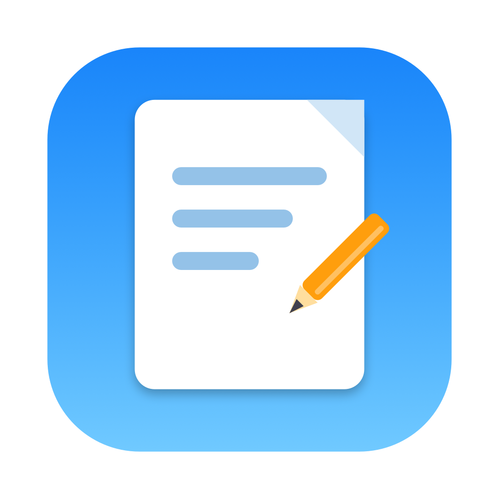

# 不跑打印店 PDFMark

**中文** | [English](#english)

一个简单、清亮的原生 macOS PDF 标注工具：打开 PDF，随手添加文字和图片，导出新文件。
不用跑打印店，也不用忍受臃肿的 PDF 套件。

<p align="center">
  
</p>

## 功能

- 打开任意 PDF：按钮选择，或直接把文件拖进窗口
- 多页支持：左侧页面缩略图导航，点击跳转
- 文字标注：双击编辑内容，字号、颜色可调
- 图片标注：插入 PNG / JPG / HEIC 等常见格式
- 自由画布：所有标注可随意拖动，图片可等比缩放
- 导出：把标注压平合并进新 PDF，可选**全部页面**或**指定页码**（如 `1-3, 5, 8`）
- 导出的 PDF 文字保持可搜索、可复制，页面尺寸与原文件一致

## 系统要求

- macOS 14 (Sonoma) 或更高版本
- Apple Silicon（M 系列）Mac

## 安装

1. 在 [Releases](../../releases) 页面下载 `不跑打印店.dmg`
2. 打开 dmg，把「不跑打印店」拖进 Applications 文件夹
3. 首次打开如被 Gatekeeper 拦截（应用使用 ad-hoc 签名、未经 Apple 公证）：
   - 右键点击应用 →「打开」→ 再点「打开」；或
   - 在终端执行：`xattr -dr com.apple.quarantine /Applications/不跑打印店.app`

## 使用

1. 打开一个 PDF
2. 点工具栏「文字」或「图片」，在当前页面添加标注，拖到想要的位置
3. 双击文字框修改内容；选中后可在工具栏调整字号和颜色
4. 选中标注后按 `⌫` 删除
5. 点「导出」，选择全部页面或输入页码范围，保存为新 PDF

## 自行构建

不需要安装 Xcode，只需要 Xcode Command Line Tools：

```bash
xcode-select --install   # 如果还没装过

./build_app.sh           # 编译并打包出 不跑打印店.app
./make_dmg.sh            # 制作 dmg 安装镜像
./make_icon.sh           # （可选）修改 tools/IconGenerator.swift 后重新生成图标
```

## 技术

- SwiftUI + PDFKit
- Swift Package Manager 构建，零第三方依赖
- 导出基于 CGPDFContext 逐页压平渲染，文字层保留（可搜索）

## License

[MIT](LICENSE)

---

<a id="english"></a>

# PDFMark (不跑打印店)

[中文](#不跑打印店-pdfmark) | **English**

A simple, clean native macOS PDF annotation tool: open a PDF, drop in text and images, export a new file.
No print shop, no bloated PDF suite required.

<p align="center">
  
</p>

## Features

- Open any PDF: pick a file, or just drag it into the window
- Multi-page support: page thumbnails in the sidebar, click to jump
- Text annotations: double-click to edit, adjustable font size and color
- Image annotations: insert PNG / JPG / HEIC and other common formats
- Free canvas: drag annotations anywhere; images resize proportionally
- Export: flatten annotations into a new PDF — **all pages** or a **custom range** (e.g. `1-3, 5, 8`)
- Exported PDFs keep text searchable and copyable, with page sizes identical to the original

## Requirements

- macOS 14 (Sonoma) or later
- Apple Silicon (M-series) Mac

## Installation

1. Download `不跑打印店.dmg` from the [Releases](../../releases) page
2. Open the dmg and drag the app into the Applications folder
3. If Gatekeeper blocks the first launch (the app is ad-hoc signed, not notarized):
   - Right-click the app → **Open** → **Open**; or
   - Run in Terminal: `xattr -dr com.apple.quarantine /Applications/不跑打印店.app`

## Usage

1. Open a PDF
2. Click **文字** (Text) or **图片** (Image) in the toolbar to add an annotation on the current page, then drag it into place
3. Double-click a text box to edit; select it to adjust font size and color in the toolbar
4. Select an annotation and press `⌫` to delete it
5. Click **导出** (Export), choose all pages or enter a page range, and save as a new PDF

## Build from Source

Xcode is **not** required — only the Xcode Command Line Tools:

```bash
xcode-select --install   # if not already installed

./build_app.sh           # build and package 不跑打印店.app
./make_dmg.sh            # create the dmg installer
./make_icon.sh           # (optional) regenerate the icon after editing tools/IconGenerator.swift
```

## Tech

- SwiftUI + PDFKit
- Built with Swift Package Manager, zero third-party dependencies
- Export flattens each page via CGPDFContext while preserving the text layer (searchable)

## License

[MIT](LICENSE)
